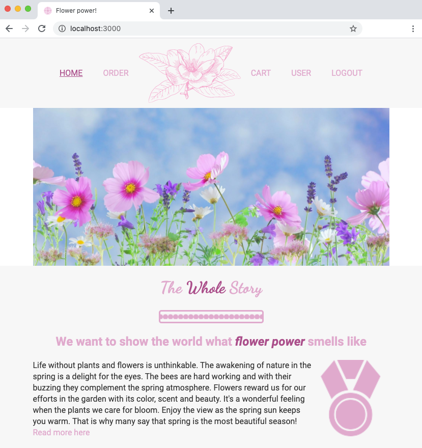
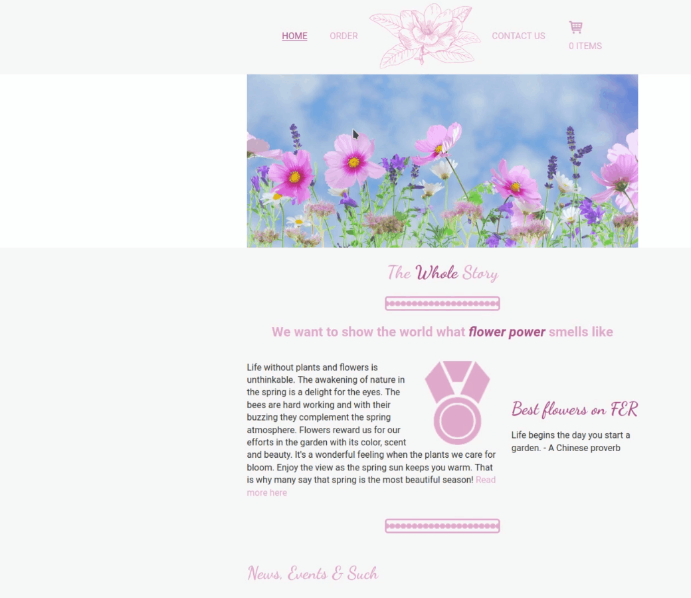
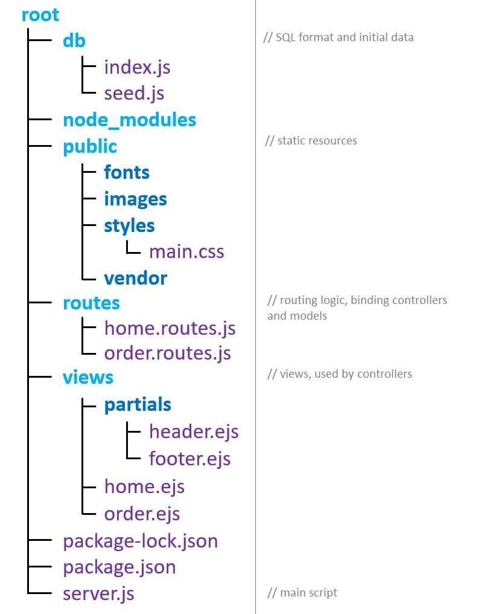
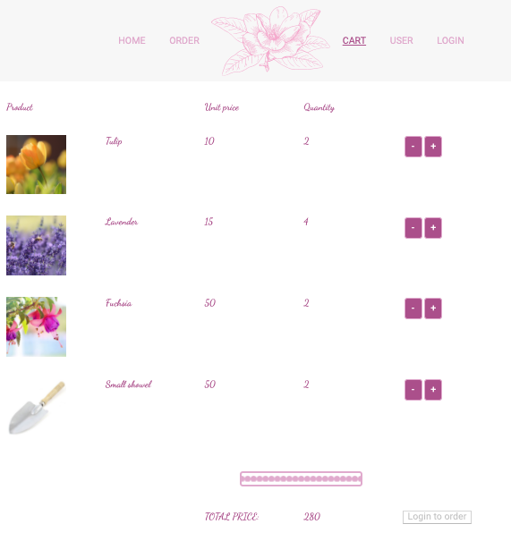
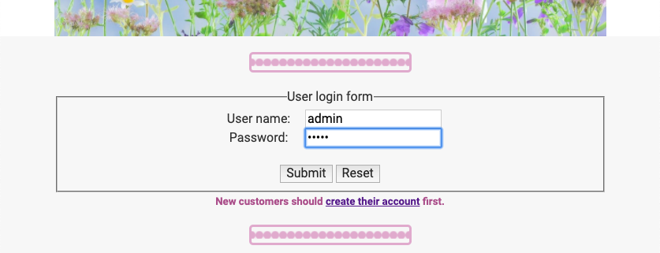
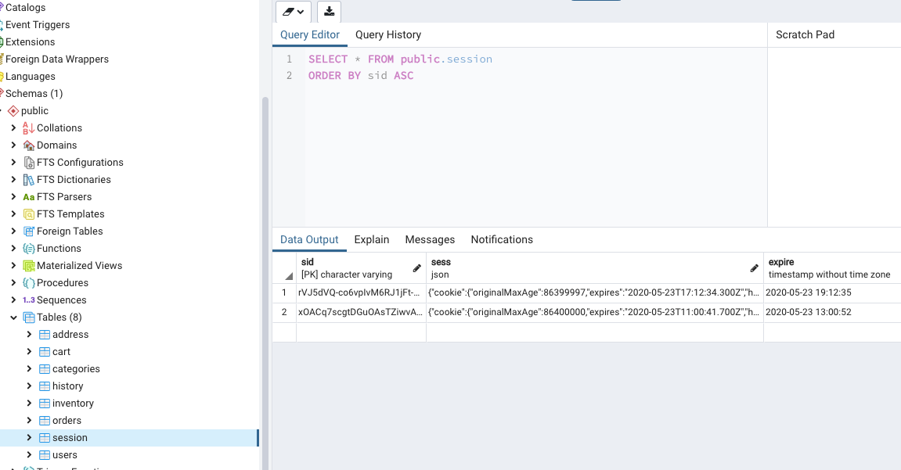
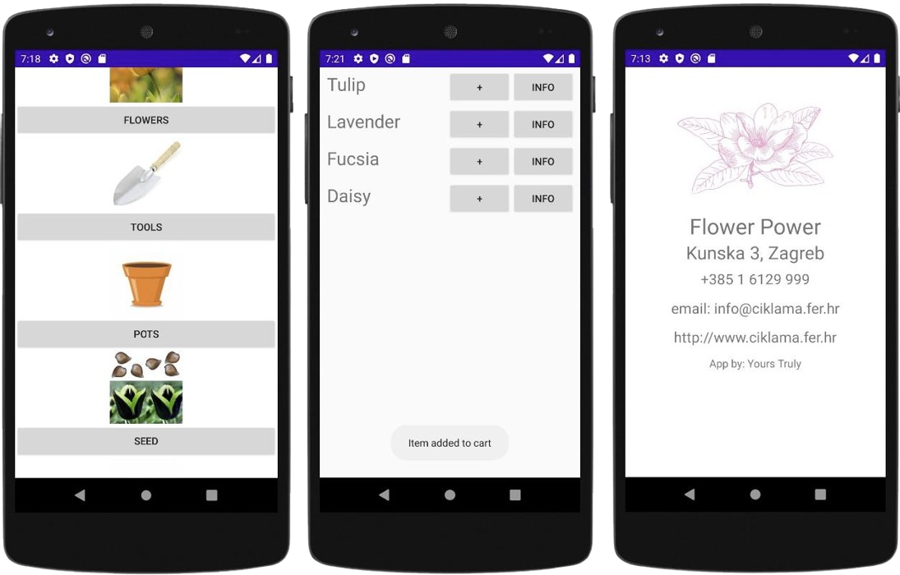

# Flower Power! - Express.js webshop for small businesses

## Purpose

*Flower Power!* is a full-stack web development project for creating a simple e-commerce website, aimed at users who only need a simple store front with an ability to take orders, and are looking to host on-premise or over IaaS.

Note: for more advanced options, involving web content management systems, analytics, search engine optimization, redundant databases, capacity scaling, security, DoS protection, etc., many [PaaS and SaaS](https://www.sap.com/resources/what-is-an-ecommerce-platform) options are available, including

- complete software: DJUST, Shopify, Hubspot

- platform: AWS, Magento, MS Azure

To streamline the learning process, the project was carried out in 4 iterations

### 1st iteration just uses static **HTML** and **CSS**

It was primarily used to develop the desired style and layout, and additional features like:

- fixed sidebar and navbar

- modal and cookie windows

- simple interactive elements like hover effects, tooltips, dropdown menus and search bars

### 2nd adds **JavaScript**

This iteration builds on top of the 1st by adding scripting, allowingthe site to:

- fetch JSON-formatted information from a remote server using async methods

- create template instances fetched data

- modify the DOM according to user action (adding to cart, filtering, cart modifications)
  
     - Local and session storage was used to track the temporary session

### 3rd iteration makes the site dynamic

- uses the **Express.js** web framework (on top of a **Node.js server**), allowing for easier:
  
     - request routing, redirecting
  
     - caching
  
     - dynamic HTML rendering
  
     - integration of various middleware (JSON parsing, serving static files, sessions etc.)

- To remove the dependency on an external server, information is now fetched from a local **PostgreSQL** database using the `connect-pg-simple` package

### 4th iteration adds persistent user sessions

This iteration improves on the 3rd with the help of Express.js's `express-session` middleware, adding:

- user accounts (registration, sign-in, management)

- authentication and access control

- persistent server-side profiles

- client-side cookie pointing to a session in the local DB

Anonymous session:

Login (or signup) starts a authenticated session:

Session persists server-side:

## Running the sites

1st and 2nd iteration are static sites, so their index.html files can just be opened in a browser.

For the 3rd and 4th, the PostgreSQL and node.js servers need to be started before you can connect to the site.

- PostgreSQL installer can be found right on the [home page](https://www.postgresql.org/). After installing and starting an instance, make sure to update the connection information in `/db` to match your setup. Running `npm run seed` will take care of populating the data.

- For running the server, you might want to consider these options
  
     - if you just want to launch the website, you can run a pre-prepared Docker container with `node.js` and `npm` package manager as described [here](https://nodejs.org/en/download). Other dependencies (`pg`, `express`, `express-validator` etc.) are specified in each iteration, so you just have to point the node.js terminal to its root, and run `npm install`.
  
     - if you wish to make your own changes, using an IDE like [Visual Studio Code](https://code.visualstudio.com/) is recommended. It has extensions for PostgreSQL, npm and node.js, and a healthy ecosystem of extensions making web dev simpler, like:
       
          - [Beautify](https://marketplace.visualstudio.com/items?itemName=HookyQR.beautify) code formatter
       
          - [Emmet](https://www.emmet.io/) helper for writing HTML
       
          - And various helpers for each mentioned technology

After starting the server, either in console with `npm start`, or using a VSC extension of your choosing, you can connect to it by pointing your browser to [localhost:3000](https://www.localhost:3000/) by default. There are also VSC extensions for embedding a dynamically-updated browser right into your IDE, making it easy to see changes as you are making them.

## Android app

A very simple mobile application was made with **Android Studio**, offering a mobile version of the website.

It supports all the same features (listing product categories, products, a shopping cart and info page), as well as english and croatian localization, but it is not connected to a database, so it serves just as an interactive, static demo.

If you do wish to run it, the simplest option is installing [Android Studio](https://developer.android.com/studio) and opening the project inside.
